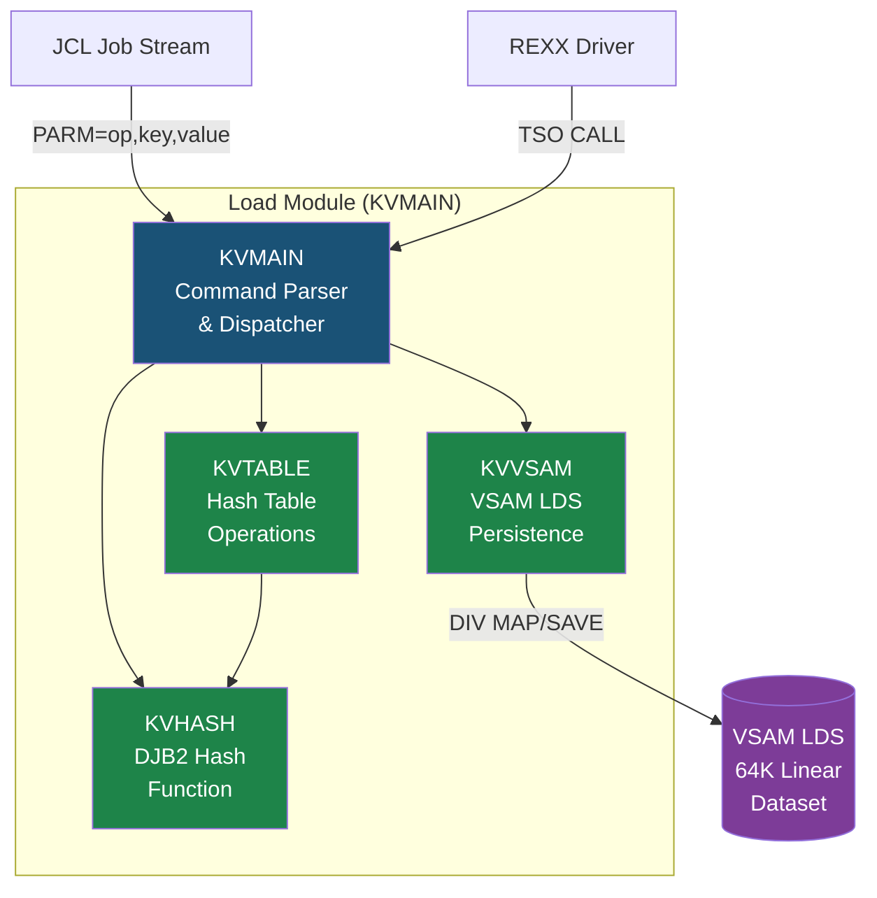

# z/OS HLASM Key-Value Store

A persistent hash table (key-value store) implemented entirely in **IBM High-Level Assembler (HLASM)**, backed by a **VSAM Linear Data Set** for persistence, and orchestrated with **JCL** job streams for build, test, and deployment.

This project demonstrates proficiency in:
- **HLASM** — data structures, hashing algorithms, register management, reentrant code
- **z/OS storage management** — VSAM Linear Data Sets, Data-In-Virtual (DIV) for memory-mapped I/O
- **JCL** — multi-step job orchestration, IDCAMS, symbolic parameters, condition code handling
- **REXX** — cross-language integration, batch test automation

---

## Architecture



### Module Breakdown

| Module | CSECT | Purpose | Key Techniques |
|--------|-------|---------|----------------|
| [KVHASH.asm](ASM/KVHASH.asm) | `KVHASH` | DJB2 hash function | Bit shifting (`SLL`), `ICM`/`IC` byte loading, `BCT` loop |
| [KVTABLE.asm](ASM/KVTABLE.asm) | `KVTABLE` | Insert/Lookup/Update/Delete/Stats | Linear probing, tombstone deletion, `EX`/`MVC` variable-length copy |
| [KVVSAM.asm](ASM/KVVSAM.asm) | `KVVSAM` | VSAM LDS persistence via DIV | `DIV IDENTIFY/MAP/SAVE/UNMAP`, `GETMAIN`/`FREEMAIN` |
| [KVMAIN.asm](ASM/KVMAIN.asm) | `KVMAIN` | PARM parser, orchestrator | JCL PARM parsing, `V()`-type external references, `WTO` logging |

### Hash Table Layout

Each entry is a fixed 64-byte structure (defined in [KVENTRY.mac](ASM/macros/KVENTRY.mac)):

```
Offset  Length  Field       Description
------  ------  ----------  ----------------------------------
+0      1       FLAGS       x'80'=occupied, x'40'=tombstone
+1      1       KEYLEN      Actual key length (1-20)
+2      2       VALLEN      Actual value length (1-32)
+4      4       HASH        Cached 32-bit hash value
+8      4       CHAIN       Chain pointer (reserved)
+12     20      KEY         Key data (null-padded)
+32     32      VALUE       Value data (null-padded)
------  ------
Total:  64 bytes per entry
```

**Table geometry:** 1024 buckets x 64 bytes = **65,536 bytes (64 KB)**, stored in a VSAM Linear Data Set with 4K control intervals.

---

## Operations

| Operation | PARM Syntax | Return Codes |
|-----------|-------------|--------------|
| **INSERT** | `INSERT,key,value` | 0=OK, 8=full, 12=duplicate |
| **LOOKUP** | `LOOKUP,key` | 0=found, 4=not found |
| **UPDATE** | `UPDATE,key,value` | 0=OK, 4=not found |
| **DELETE** | `DELETE,key` | 0=OK, 4=not found |
| **STATS**  | `STATS` | 0=OK (always) |

### Collision Resolution

Uses **open addressing with linear probing**. When a hash collision occurs, the algorithm scans forward through consecutive buckets until finding an empty slot. Deleted entries are marked as **tombstones** (flag `x'40'`), allowing probe chains to continue past them while permitting slot reuse on insertion.

### Hash Algorithm

**DJB2** by Daniel J. Bernstein: `hash = ((hash << 5) + hash) + byte`, starting from seed `5381`. Chosen for its simplicity in assembly (one shift, two adds per byte) and good distribution properties across short string keys typical in mainframe applications.

---

## Project Structure

```
.
├── ASM/                          # HLASM source code
│   ├── KVMAIN.asm                #   Main driver (entry point)
│   ├── KVHASH.asm                #   DJB2 hash function
│   ├── KVTABLE.asm               #   Hash table operations
│   ├── KVVSAM.asm                #   VSAM persistence layer
│   └── macros/                   #   Custom macros
│       ├── KVENTRY.mac           #     Entry DSECT + constants
│       └── VSAMIO.mac            #     DIV I/O wrapper macros
├── JCL/                          # Job control language
│   ├── allocate.jcl              #   Define VSAM LDS (IDCAMS)
│   ├── compile.jcl               #   Assemble + link-edit
│   ├── test-insert.jcl           #   INSERT functional tests
│   ├── test-lookup.jcl           #   LOOKUP/UPDATE/DELETE tests
│   ├── stress-test.jcl           #   Performance test (500 records)
│   ├── cleanup.jcl               #   Remove all datasets
│   └── run-all.jcl               #   Full pipeline (build + test)
├── REXX/                         # REXX exec
│   └── KVDRIVER.rexx             #   Interactive/batch test driver
├── DATA/                         # Test data
│   ├── sample-inserts.txt        #   Realistic mainframe test data
│   └── collision-test.txt        #   Hash collision test cases
├── DOCS/                         # Additional documentation
├── zapp.yaml                     # IBM Z Open Editor config
├── .gitignore
├── LICENSE
└── README.md
```

---

## How to Build and Run

### Prerequisites

- z/OS system (or [Hercules](http://www.hercules-390.org/) with z/OS, or [IBM zD&T](https://www.ibm.com/products/z-development-test-environment))
- High-Level Assembler (ASMA90) installed
- VSAM access (IDCAMS)
- TSO/ISPF for interactive testing

### Option A: Traditional JCL (TSO/ISPF)

```
1. Upload source to z/OS:
   - ASM/*.asm  -> USERID.KVSTORE.ASM (PDS, FB/80)
   - ASM/macros/*.mac -> USERID.KVSTORE.MACLIB (PDS, FB/80)
   - JCL/*.jcl  -> USERID.KVSTORE.JCL (PDS, FB/80)

2. Allocate the load library:
   TSO ALLOC DA('USERID.KVSTORE.LOAD') NEW DSORG(PO) DIR(10)
       RECFM(U) LRECL(0) BLKSIZE(6144) SPACE(5 5) CYLINDERS

3. Submit jobs in order:
   SUB 'USERID.KVSTORE.JCL(ALLOCATE)'   <- Define VSAM LDS
   SUB 'USERID.KVSTORE.JCL(COMPILE)'    <- Assemble + link
   SUB 'USERID.KVSTORE.JCL(TSTINSRT)'   <- Test inserts
   SUB 'USERID.KVSTORE.JCL(TSTLOOKP)'   <- Test operations
   SUB 'USERID.KVSTORE.JCL(STRESS)'     <- Performance test

   Or run the full pipeline:
   SUB 'USERID.KVSTORE.JCL(RUNALL)'
```

### Option B: Modern Workflow (Zowe CLI + VS Code)

```bash
# Install Zowe CLI and IBM Z Open Editor extension for VS Code
npm install -g @zowe/cli

# Configure z/OS connection
zowe profiles create zosmf myhost --host mainframe.example.com --port 443 --user USERID --password ****

# Upload source files
zowe files upload dir-to-pds ASM/ USERID.KVSTORE.ASM
zowe files upload dir-to-pds ASM/macros/ USERID.KVSTORE.MACLIB
zowe files upload dir-to-pds JCL/ USERID.KVSTORE.JCL

# Submit and monitor
zowe jobs submit ds "USERID.KVSTORE.JCL(RUNALL)" --wfo
```

---

## Sample Output

### Successful INSERT + LOOKUP sequence

```
KVMAIN: Opening VSAM LDS...
KVVSAM: VSAM LDS opened and mapped successfully
KVMAIN: Executing operation...
KVMAIN: Operation completed successfully (RC=0)
KVMAIN: Saving changes to VSAM LDS...
KVVSAM: Table data saved to VSAM LDS
KVMAIN: Closing VSAM LDS...
KVVSAM: VSAM LDS closed and unmapped

KVMAIN: Opening VSAM LDS...
KVVSAM: VSAM LDS opened and mapped successfully
KVMAIN: Executing operation...
KVMAIN: LOOKUP result:
KVMAIN: Value=BALANCE=15000
KVMAIN: Closing VSAM LDS...
KVVSAM: VSAM LDS closed and unmapped
```

### Stress test summary (500 records)

```
=============================================
  Stress Test Summary
=============================================
  Records:          500
  Table buckets:    1024
  Load factor:      48.8%
  Insert success:   500/500
  Lookup success:   500/500
  Total time:       12.45 sec
=============================================
```

---

## Design Decisions

### Why VSAM LDS over KSDS?

A **VSAM Key-Sequenced Data Set (KSDS)** manages its own key index, which would duplicate the work our hash table already does. A **Linear Data Set (LDS)** gives us raw, byte-addressable storage — essentially a flat file that maps directly into virtual memory via **Data-In-Virtual (DIV)**. This means:

- Zero overhead from VSAM's key management (we are the index)
- Memory-mapped semantics — the hash table exists in virtual storage and is transparently persisted
- No CI/CA split overhead since we control our own layout

### Why DJB2 hash?

Simplicity in assembly: the core loop is just **SLL + AR + AR** (shift-left-5, add-hash, add-byte). More complex hashes like FNV-1a or MurmurHash would improve distribution but require XOR operations and larger magic constants. DJB2 provides good distribution for the short alphanumeric keys typical in mainframe applications (account numbers, config keys, session IDs) while keeping the instruction count per byte to a minimum.

### Why linear probing over separate chaining?

Linear probing keeps the entire table in a single contiguous memory region, which is critical for DIV mapping — the VSAM LDS is mapped as one flat block. Separate chaining would require dynamic `GETMAIN` for overflow nodes, complicating both the memory model and VSAM persistence. Linear probing also has better cache locality on z/Architecture, where L1 cache lines are 256 bytes (4 entries fit in one cache line).

### Why reentrant code?

All production z/OS programs must be reentrant (re-executable from shared storage). Our modules use `GETMAIN` for dynamic workareas instead of static `DS` storage, and are assembled with the `RENT` option. This is not optional for any code that runs in a production MVS environment — it's a fundamental requirement that interviewers will check for.

---

## Technical Highlights

- **AMODE 31 / RMODE 24** — 31-bit addressing with residence below the 16MB line (required for JCL PARM access via R1)
- **Reentrant design** — all modules use `GETMAIN`/`FREEMAIN` for workareas, no writable static storage
- **Executed instructions (`EX`)** — variable-length MVC operations for key/value copying without fixed-length padding overhead
- **BCT-based loops** — Branch on Count for efficient loop control without explicit compare/branch pairs
- **WTO logging** — production-style operator console messages for operation tracking
- **Condition code propagation** — JCL `COND=` parameters chain step execution based on prior return codes
- **IDCAMS mastery** — `IF/THEN/ELSE/ENDIF` constructs, `SET MAXCC`, `LISTCAT` verification
- **Symbolic JCL parameters** — `SET` statements for HLQ, dataset names, and table sizes

---

## Future Enhancements

- [ ] ESTAE error recovery routine (abend handling)
- [ ] Dynamic table resize when load factor exceeds 75%
- [ ] FNV-1a hash as compile-time selectable alternative
- [ ] Separate chaining mode (switchable via macro parameter)
- [ ] CICS-compatible version (quasi-reentrant, EXEC CICS interface)
- [ ] SMF record generation for performance metrics
- [ ] Batch mode: read operations from SYSIN sequential dataset

---

## License

[MIT](LICENSE)

---

> Built as a portfolio demonstration of IBM z/OS mainframe systems programming skills.
> Technologies: HLASM, JCL, VSAM, REXX, z/OS, Data-In-Virtual
